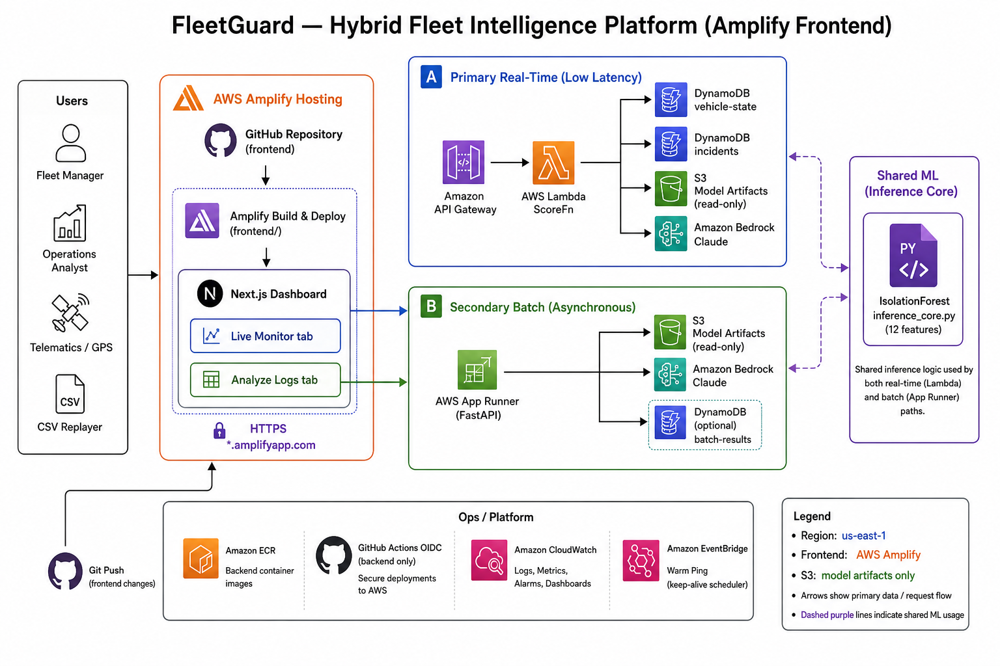

# FleetGuard

**AI-powered fleet intelligence for Nigerian logistics** — detect fuel theft, route abuse, private
vehicle use, and excessive idling in real time, with human-readable incident reports powered by
Amazon Bedrock.

**Region:** `us-west-2` · **Hackathon submission:** [SOW.md](SOW.md)

---

## The problem

Fleet operators lose money when they cannot answer:

- Did the driver follow **approved routes**?
- Was **fuel** used for deliveries or stolen?
- Is the vehicle used **privately** after hours?
- Are drivers **idling** excessively (wasted fuel and time)?

Spreadsheets and end-of-day reports are too slow. FleetGuard scores every telemetry ping as it
arrives and surfaces explainable alerts managers can act on immediately.

---

## Our solution

FleetGuard is a **hybrid command center** with two modes sharing one ML model:

| Mode | Who | How | Outcome |
| --- | --- | --- | --- |
| **Live Monitor** (primary) | Fleet manager | GPS/fuel pings stream to `POST /score` | Incidents appear in seconds on a map + log with AI reports |
| **Analyze Logs** (secondary) | Operations analyst | Upload trip-log CSV to `POST /api/v1/analyze-fleet` | Full forensic audit — ranked anomalies + AI insights |

**Detection:** unsupervised **IsolationForest** (12 features) — no labelled production data required.  
**Explainability:** **Amazon Bedrock** (Claude) writes a concise incident report for each flagged event.

### Anomaly types

| Type | What we detect |
| --- | --- |
| **Fuel theft** | Large fuel drop while stationary, engine on |
| **Route deviation** | Vehicle far outside approved Lagos delivery zones |
| **Private use** | Movement off-hours and off-route |
| **Excessive idle** | Engine on, no movement, prolonged idle time |

---

## Architecture

**Hybrid design:** serverless real-time path + container batch path + shared ML layer.



Full diagram and flows: [Architecture-diagram.md](fleetguard_prep/docs/Architecture-diagram.md)

```
Next.js dashboard (AWS Amplify)
       │
       ├── Path A ── API Gateway ── Lambda (container) ── DynamoDB + Bedrock
       │                      └── S3 (model artifacts)
       │
       └── Path B ── App Runner ── FastAPI ── same model + Bedrock
```

Both paths use **identical feature engineering and scoring** (`ml/src/inference/inference_core.py`).
Scores are parity-tested so live and batch results stay consistent.

---

## AWS services (and why)

| Service | Role | Why this service |
| --- | --- | --- |
| **Lambda + API Gateway** | Path A — real-time `POST /score`, `GET /incidents` | Scale-to-zero, pay-per-ping; matches bursty telematics |
| **App Runner** | Path B — FastAPI CSV batch analysis | Always-warm container; handles large multipart uploads |
| **S3** | Model artifacts (IsolationForest + scaler) | Decouple retrain from redeploy |
| **DynamoDB** | Incidents + per-vehicle state (`fuel_delta`) | Fast writes; no SQL ops for demo scale |
| **Amazon Bedrock** | Incident report text (Claude Opus 4.6) | Managed GenAI in-region; no GPU infra |
| **AWS Amplify** | Next.js dashboard (Git deploy, HTTPS) | Fastest AWS-native frontend CI |
| **CloudWatch** | Logs and metrics | Zero-config observability |
| **EventBridge** | Lambda warm ping (demo) | Reduces cold-start risk during judging |

Service comparisons and alternatives: [SOW.md §6](SOW.md#6-technical-specifications--aws-service-selection)

**Production scaling path:** replace CSV replayer with **AWS IoT Core / Kinesis** → same Lambda scoring API.

---

## ML performance

Trained on mock Lagos fleet data (10 vehicles, ~4,800 pings, ~12% injected anomalies):

| Metric | Result |
| --- | --- |
| Anomaly **F1** | **0.994** |
| Precision / recall (anomaly class) | 0.990 / 0.998 |
| Detection by type | fuel theft, route deviation, private use, excessive idle — all ~100% on mock labels |

Sample data: [`ml/data/mock/fleetguard_telemetry.csv`](ml/data/mock/fleetguard_telemetry.csv)

---

## Live demo

| Asset | URL / location |
| --- | --- |
| **Path B API** (Analyze Logs) | https://vxyrxhcfwr.us-west-2.awsapprunner.com |
| **Dashboard** (Amplify) | _Set in Amplify Console — see [docs/deploy-urls.md](docs/deploy-urls.md)_ |
| **Path A API** (Live Monitor) | _Pending SAM deploy — `GET /incidents`, `POST /score`_ |

### 5-minute judge walkthrough

1. **Live Monitor** — start telemetry replayer; watch anomalies appear on the map and incident log.
2. **Click an incident** — read the Bedrock-generated report (what happened + recommended action).
3. **Analyze Logs** — upload `fleetguard_telemetry.csv` (also in [`frontend/public/samples/`](frontend/public/samples/)).
4. **Review batch results** — summary cards, scored table, top-N AI insight cards (same model as live path).
5. **Scaling note** — production ingestion via IoT Core / Kinesis; history via Timestream or S3 + Athena.

Detailed script: [docs/app_flow.md §5](docs/app_flow.md#5-demo-script-5-minutes-for-judges)

**Demo fallback:** if live stream is slow, the **Analyze Logs** tab works standalone; incidents can be pre-seeded via `ml/scripts/replay.py --mode seed`.

---

## Try it locally (optional)

```powershell
# From repo root
py -m venv .venv
.\.venv\Scripts\Activate.ps1
pip install -r ml/requirements.txt -r backend/requirements.txt

# Path B — batch API
cd backend
copy .env.example .env
uvicorn app.main:app --reload --port 8080

# In another terminal — smoke test
cd ..
.\infrastructure\scripts\smoke_path_b.ps1 -BaseUrl http://127.0.0.1:8080
```

Deploy to AWS: [infrastructure/scripts/bootstrap_checklist.md](infrastructure/scripts/bootstrap_checklist.md)

---

## Documentation (for reviewers)

| Document | Contents |
| --- | --- |
| **[SOW.md](SOW.md)** | Executive summary, business case, AWS justifications, phases, risks, success criteria |
| **[Architecture-diagram.md](fleetguard_prep/docs/Architecture-diagram.md)** | Architecture narrative + Mermaid diagrams |
| **[docs/prd.md](docs/prd.md)** | Product requirements |
| **[docs/api_contract.md](docs/api_contract.md)** | HTTP request/response shapes (both paths) |
| **[docs/data_schema.md](docs/data_schema.md)** | CSV columns, features, DynamoDB schema |
| **[docs/app_flow.md](docs/app_flow.md)** | User journeys and demo script |

---

## Repository layout

```
FleetGuard/
├── ml/                 ML pipeline, Lambda handler (Path A), shared inference core
├── backend/            FastAPI batch service (Path B)
├── frontend/           Next.js dashboard — Live Monitor + Analyze Logs (Amplify)
├── infrastructure/     SAM template, deploy & smoke scripts
├── docs/               Product and API documentation
└── SOW.md              Hackathon statement of work
```

---

## Team & status

| Component | Status |
| --- | --- |
| ML training + evaluation | Complete (F1 0.994) |
| Shared inference + parity tests | Complete |
| Path A Lambda handler | Complete (deploy via SAM) |
| Path B FastAPI | Complete (local + App Runner Dockerfile) |
| Frontend dashboard | In progress (Amplify) |
| AWS deploy | SAM + scripts ready; run [bootstrap checklist](infrastructure/scripts/bootstrap_checklist.md) |

**Estimated AWS demo cost:** under ~$5 (Free Tier where applicable).

---

*FleetGuard — catch fleet losses early. One model, two paths, full AWS stack.*
