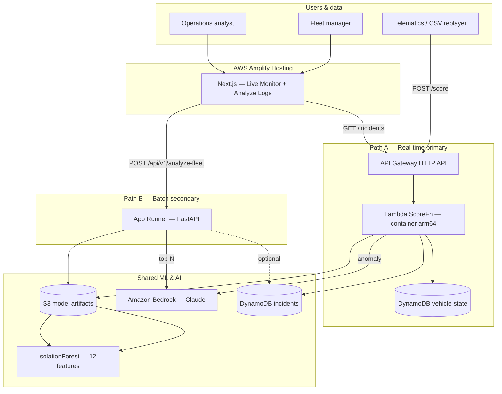

# FleetGuard — Statement of Work (SOW)

**Project:** FleetGuard — AI-powered fleet anomaly detection for Nigerian logistics  
**Region:** `us-east-1`  
**Version:** 1.0 (hackathon submission)  
**Related docs:** [Architecture diagram](Architecture-diagram.md) · [PRD](docs/prd.md) · [Technical spec](fleetguard_prep/docs/technicals.md)

---

## 1. Executive Summary

FleetGuard is a fleet intelligence platform that helps Nigerian logistics operators detect **fuel
theft**, **route abuse**, **private vehicle use**, and **excessive idling** before losses compound.
The system combines **unsupervised machine learning** (IsolationForest on 12 telemetry features)
with **Amazon Bedrock** (Claude) to turn raw GPS and fuel pings into ranked, human-readable
incident reports.

FleetGuard uses a **hybrid AWS architecture**:

- **Path A (primary):** Real-time scoring via **Lambda + API Gateway** — anomalies surface in
  seconds as telematics pings arrive.
- **Path B (secondary):** Batch forensic audit via **FastAPI on App Runner** — operators upload
  trip-log CSVs and receive a full scored report with AI insights.
- **Shared layer:** One model in **S3**, one inference core, incidents in **DynamoDB**, dashboard
  on **AWS Amplify Hosting**.

Phase 1 (ML pipeline) is complete: mock Lagos fleet data, trained model (offline F1 **0.994**),
parity-tested inference core, Lambda handler, and FastAPI batch service. Remaining work is AWS
deployment, frontend polish, and demo rehearsal.

**Estimated demo cost:** &lt; $5 (Free Tier where applicable).

---

## 2. Project Overview

### 2.1 Problem statement

Fleet managers in Nigeria often cannot verify whether drivers followed approved routes, whether
fuel was used for deliveries versus stolen, or whether vehicles are used privately after hours.
Manual log review is slow and misses subtle patterns across thousands of pings per vehicle.

### 2.2 Solution

FleetGuard ingests vehicle telemetry (speed, fuel level, idle time, GPS zone distance, engine
state, time-of-day signals) and flags statistical outliers. For each anomaly, Bedrock generates
a concise incident report a manager can act on immediately.

### 2.3 Product modes

| Mode | User | Entry point | Outcome |
| --- | --- | --- | --- |
| **Live Monitor** (primary) | Fleet manager | Dashboard + `POST /score` stream | Real-time incident feed with map and AI reports |
| **Analyze Logs** (secondary) | Operations analyst | CSV upload via `POST /api/v1/analyze-fleet` | Forensic table, charts, top-N AI insights |

### 2.4 Anomaly types detected

| Type | Signal (simplified) |
| --- | --- |
| Route deviation | Vehicle far outside approved Lagos delivery zones at high speed |
| Fuel theft | Large fuel drop while stationary, engine on |
| Private use | Movement outside working hours and approved areas |
| Excessive idle | Engine on, no movement, idle time very high |

### 2.5 Scope boundaries

**In scope:** Real-time and batch scoring, Bedrock incident reports, Next.js dashboard (two tabs),
AWS deployment, CSV replayer for demo, pre-seeded incidents as fallback.

**Out of scope (this sprint):** Cognito auth, real telematics device integration, Kinesis/IoT Core
production ingestion, automated retraining, multi-region, custom domain/WAF.

### 2.6 Repository structure

```
FleetGuard/
├── frontend/          Next.js dashboard (Amplify)
├── backend/           FastAPI batch service (App Runner)
├── ml/                Shared ML pipeline, Lambda handler, model artifacts
├── infrastructure/    Terraform modules (Lambda, App Runner, DynamoDB, S3, Amplify)
└── docs/              PRD, API contract, team guide
```

---

## 3. Business Case

### 3.1 Financial impact

| Loss driver | Typical impact | FleetGuard value |
| --- | --- | --- |
| Fuel theft | 5–15% of fleet fuel budget | Flags abnormal fuel drops at ping granularity |
| Route abuse / private use | Unbilled mileage, insurance risk | Detects off-route and off-hours movement |
| Excessive idling | Wasted fuel and driver time | Surfaces idle-with-engine-on patterns |
| Manual audit lag | Incidents discovered days later | Real-time alerts + instant CSV forensic audit |

### 3.2 Strategic fit

- **Operational:** Gives fleet managers a single command center instead of spreadsheets and
  end-of-day reports.
- **Technical:** Demonstrates a production-shaped AWS stack — serverless real-time path,
  container batch path, managed GenAI — without over-engineering for hackathon scale.
- **Scalability path:** Demo uses CSV replay; production can swap the replayer for **Kinesis** or
  **AWS IoT Core** without changing the scoring model or API contract.

### 3.3 Return on investment (demo → production)

| Phase | Investment | Return |
| --- | --- | --- |
| Hackathon MVP | ~5–6 engineer-hours deploy + existing ML | Working live demo, judge-ready narrative |
| Pilot (1 fleet, 50 vehicles) | Amplify + Lambda + DynamoDB on-demand | Near-zero idle cost; pay per ping scored |
| Scale (500+ vehicles) | Add Kinesis buffer, optional Timestream for history | Same model; ingestion layer scales independently |

### 3.4 Why AWS-native

All components run in **us-east-1** with managed services: no GPU servers to operate, no
third-party LLM egress, and a clear story for judges on service selection and cost control.

---

## 4. High-Level Technical Architecture

### 4.1 Architecture diagram


Full narrative and Mermaid sources: [Architecture-diagram.md](Architecture-diagram.md).

### 4.2 Logical flow



### 4.3 Data flow summary

| Step | Path A (real-time) | Path B (batch) |
| --- | --- | --- |
| 1 | Ping arrives at `POST /score` | CSV uploaded to `POST /api/v1/analyze-fleet` |
| 2 | Lambda loads model from S3; computes `fuel_delta` from vehicle-state | FastAPI loads model; computes `fuel_delta` via pandas groupby |
| 3 | IsolationForest scores ping | Scores all rows; ranks anomalies |
| 4 | Anomaly → Bedrock Sonnet report → DynamoDB | Top-N → Bedrock Haiku; optional summary via Sonnet |
| 5 | Dashboard polls `GET /incidents` | Dashboard renders table, scatter chart, AI cards |

### 4.4 Key design decisions

| Decision | Choice | Rationale |
| --- | --- | --- |
| Primary path | Lambda + API Gateway | Scale-to-zero, per-ping latency for live monitoring |
| Secondary path | App Runner + FastAPI | Multipart CSV, pandas batch, no Lambda timeout limits |
| Shared ML | Single `inference_core.py` + S3 artifacts | Score parity across both paths |
| Frontend | Next.js on Amplify | Git-connected deploy; no manual S3/CloudFront CI |
| GenAI | Bedrock (Claude) | Managed, in-region, pay-per-token |
| Persistence | DynamoDB on-demand | Fast incident writes; GSI by vehicle_id |

### 4.5 CI/CD split

| Layer | Mechanism |
| --- | --- |
| Frontend | **Amplify** auto-build on Git push to `frontend/` |
| Backend / infra | **GitHub Actions (OIDC)** → ECR → Terraform (Lambda, App Runner, DynamoDB, S3) |

---

## 5. Functional Requirements

### 5.1 Path A — Real-time monitoring (must have)

| ID | Requirement | Acceptance |
| --- | --- | --- |
| FR-A1 | Accept telemetry via `POST /score` (single or batch JSON) | Valid ping returns `is_anomaly`, `score` per row |
| FR-A2 | Score with IsolationForest (12 features, shared model) | Matches batch path on identical input (parity test) |
| FR-A3 | Generate Bedrock incident report for anomalies | Non-empty `report` text on flagged pings |
| FR-A4 | Persist anomalies to DynamoDB with `source: realtime` | Records visible via `GET /incidents` |
| FR-A5 | Compute `fuel_delta` server-side (vehicle-state table) | Caller does not send `fuel_delta` |
| FR-A6 | Support CSV replayer for live demo | `ml/scripts/replay.py` streams mock telemetry |

### 5.2 Path B — Batch audit (must have)

| ID | Requirement | Acceptance |
| --- | --- | --- |
| FR-B1 | Accept trip-log CSV via `POST /api/v1/analyze-fleet` | Parses ~5k rows in &lt; 30 s |
| FR-B2 | Return summary + scored table + top anomalies | JSON includes counts and ranked list |
| FR-B3 | Bedrock insights for top-N anomalies only | Cost-controlled; not every row calls LLM |
| FR-B4 | Server-side `fuel_delta` from uploaded file | Correct per-vehicle fuel deltas |
| FR-B5 | Dashboard: table, scatter chart, AI insight cards | Analyze Logs tab fully wired |

### 5.3 Frontend (must have)

| ID | Requirement | Acceptance |
| --- | --- | --- |
| FR-F1 | **Live Monitor:** map, incident log, AI report panel | Reads Path A APIs |
| FR-F2 | **Analyze Logs:** dropzone, results table, visualization | Reads Path B API |
| FR-F3 | Summary cards: vehicles, anomalies, breakdown by type | Updates after each operation |
| FR-F4 | Dual env vars: `NEXT_PUBLIC_API_URL`, `NEXT_PUBLIC_BATCH_API_URL` | Both tabs functional when deployed |

### 5.4 Shared (must have)

| ID | Requirement | Acceptance |
| --- | --- | --- |
| FR-S1 | Same model artifacts on Path A and B | Single S3 prefix / local `ml/models/` |
| FR-S2 | Parity test passes before merge | `pytest ml/tests/` green |
| FR-S3 | Deploy on AWS (Lambda, App Runner, S3, DynamoDB, Bedrock, Amplify) | End-to-end demo in cloud |

### 5.5 Non-functional requirements

| ID | Requirement | Target |
| --- | --- | --- |
| NFR-1 | Region | `us-east-1` |
| NFR-2 | Real-time scoring latency | &lt; 2 s per batch (excl. Bedrock) |
| NFR-3 | Batch analysis | &lt; 30 s for ~4,800 rows |
| NFR-4 | Demo cost | &lt; ~$5 total |
| NFR-5 | Auth | None for hackathon (Cognito = future) |

---

## 6. Technical Specifications & AWS Service Selection

Each primary AWS service is chosen against **two alternatives**. Comparisons reflect hackathon
constraints (speed, cost, AWS-native requirement) and the hybrid workload (bursty pings vs CSV
batch).

### 6.1 Path A compute — AWS Lambda (container image)

**Role:** Score individual telemetry pings; invoke Bedrock; read/write DynamoDB.

| Attribute | Specification |
| --- | --- |
| Runtime | Python 3.11 container on `arm64` |
| Memory / timeout | 512 MB, 30 s |
| Packaging | ECR image (scikit-learn exceeds zip limit) |
| Model load | S3 at cold start; cached in execution environment |
| Warmth | EventBridge ping every 5 min during demo |

**Why Lambda (chosen)**

| Criterion | Lambda | Alternative 1: SageMaker endpoint | Alternative 2: EC2 / ECS Fargate |
| --- | --- | --- | --- |
| Cost at demo scale | Pay per request; scale to zero | Always-on instance (~$30+/mo minimum) | Always-on + ops overhead |
| Fit for bursty pings | Native event-per-ping model | Overkill for small sklearn tree | Requires auto-scaling config |
| Hackathon speed | SAM/Terraform modules well documented | Endpoint + model package setup slower | Cluster/service definition heavier |
| sklearn dependency | Container image solves 250 MB zip limit | Same, but more moving parts | Same |

**Decision:** Lambda container is the lowest-cost, fastest path for stateless per-ping scoring.

---

### 6.2 Path A API — Amazon API Gateway (HTTP API)

**Role:** Public HTTPS front door for `POST /score` and `GET /incidents`.

| Attribute | Specification |
| --- | --- |
| Type | HTTP API (not REST) |
| Integration | Lambda proxy |
| CORS | Enabled for Amplify domain |

**Why API Gateway HTTP API (chosen)**

| Criterion | HTTP API | Alternative 1: REST API | Alternative 2: Lambda Function URL |
| --- | --- | --- | --- |
| Cost | ~70% cheaper than REST at scale | Higher per-request cost | No per-API cost, but fewer features |
| Latency | Lower overhead for simple routes | Extra features unused (API keys, caching) | Direct invoke; no stage/routing |
| Routing | `/score`, `/incidents` on one API | Same, but heavier config | One URL per function; awkward multi-route |
| Throttling / stages | Built-in | Built-in | Limited compared to API Gateway |
| Demo narrative | Standard “API + Lambda” pattern | Same, but over-provisioned | Harder to explain multi-route setup |

**Decision:** HTTP API is the cost-optimal managed front door for two Lambda-backed routes.

---

### 6.3 Path B compute — AWS App Runner

**Role:** Host FastAPI service for multipart CSV upload and pandas batch scoring.

| Attribute | Specification |
| --- | --- |
| Framework | FastAPI (Python 3.11+) |
| Container | ECR image from `backend/Dockerfile` |
| Endpoints | `GET /healthz`, `POST /api/v1/analyze-fleet` |
| Bedrock | Haiku for top-N rows; optional Sonnet summary |

**Why App Runner (chosen)**

| Criterion | App Runner | Alternative 1: Lambda | Alternative 2: ECS Fargate |
| --- | --- | --- | --- |
| CSV upload + pandas | Long-running request, large in-memory DataFrame | 15 min max timeout; memory/cold-start pain | Works, but more IaC (cluster, ALB, task def) |
| Always warm | Default for App Runner service | Cold starts unless provisioned concurrency | Configurable, but not automatic |
| Deploy complexity | Connect ECR → deploy | Lambda + API Gateway + payload limits | VPC, ALB, service, target group |
| Cost at demo scale | Low for single small instance | Cheaper per invoke, poor fit for 5k-row batch | Similar compute, higher setup time |
| Hackathon timeline | Fastest “run a container” path | Wrong tool for batch file processing | Over-engineered for one API |

**Decision:** App Runner is the simplest always-warm container host for the batch audit path.

---

### 6.4 Persistence — Amazon DynamoDB (on-demand)

**Role:** Incident store (`fleetguard-incidents`) and per-vehicle last ping (`fleetguard-vehicle-state`).

| Table | Key design | Purpose |
| --- | --- | --- |
| `fleetguard-incidents` | PK `incident_id`; GSI `vehicle_id-index` | Live feed, filters by vehicle/source |
| `fleetguard-vehicle-state` | PK `vehicle_id` | Server-side `fuel_delta` for Path A |

**Why DynamoDB (chosen)**

| Criterion | DynamoDB | Alternative 1: Amazon RDS / Aurora | Alternative 2: Amazon Timestream |
| --- | --- | --- | --- |
| Access pattern | Key-value + GSI lookup | Relational joins unused | Optimized for time-series writes |
| Ops burden | Serverless on-demand | DB sizing, patches, connections | Separate query model for incidents |
| Write latency | Single-digit ms | Good, but overkill for demo | Better at massive ping history |
| Cost at demo scale | Free Tier friendly | Minimum instance cost | Minimum storage cost |
| Incident feed | Natural fit for `GET /incidents` | Requires SQL + API layer | Not ideal for document-style reports |

**Decision:** DynamoDB matches incident key-value access; Timestream reserved as future path for
full GPS history at fleet scale.

---

### 6.5 Model storage — Amazon S3

**Role:** Store `fleetguard_anomaly_model.pkl`, scaler, and `fleetguard_feature_cols.json`.

| Attribute | Specification |
| --- | --- |
| Bucket | Dedicated model bucket (no public access) |
| Prefix | `fleetguard-model/` |
| Consumers | Lambda (Path A) and App Runner (Path B) read same prefix |

**Why S3 (chosen)**

| Criterion | S3 | Alternative 1: Bundle in container image | Alternative 2: Amazon EFS |
| --- | --- | --- | --- |
| Retrain workflow | Re-upload artifacts; no redeploy | Rebuild + redeploy both images | Remount / sync complexity |
| Decoupling | Model version independent of code | Couples ML lifecycle to CI/CD | Shared file system overhead |
| Cost | Pennies at demo scale | Same storage, hidden in ECR layers | EFS minimum cost + VPC |
| Lambda access | Native SDK; no VPC required | Larger images → slower cold start | Requires VPC mount for Lambda |

**Decision:** S3 decouples model updates from application deploys.

---

### 6.6 GenAI — Amazon Bedrock (Claude 3.5 Sonnet / Haiku)

**Role:** Generate human-readable incident reports from anomaly feature context.

| Path | Model | Rationale |
| --- | --- | --- |
| Path A (real-time) | Claude 3.5 Sonnet | Higher quality per critical live alert |
| Path B (batch top-N) | Claude 3 Haiku | Faster, cheaper for multiple rows |

**Why Bedrock (chosen)**

| Criterion | Bedrock (Claude) | Alternative 1: Self-hosted open-weight LLM | Alternative 2: External API (e.g. OpenAI) |
| --- | --- | --- | --- |
| Infra | Fully managed; no GPU | GPU instance + model ops | Third-party dependency |
| Data residency | Stays in AWS region | Your responsibility | Data egress outside AWS |
| Hackathon requirement | AWS-native stack | Off-stack for judges | Off-stack for judges |
| Cost at demo volume | Cents per report | Hours of GPU even idle | Similar token cost, wrong ecosystem |
| Output quality | Strong narrative for incidents | Variable; tuning required | Strong, but not AWS |

**Also considered:** Amazon Comprehend — rejected because we need **free-form incident narratives**,
not classification or entity extraction alone.

**Reliability:** Pre-seed demo incidents in DynamoDB; fallback to cached text if Bedrock throttles.

---

### 6.7 Frontend — AWS Amplify Hosting

**Role:** Build and host Next.js dashboard (`frontend/`); HTTPS; environment variables for API URLs.

| Attribute | Specification |
| --- | --- |
| Build spec | `frontend/amplify.yml` — `npm ci`, `npm run build` |
| App root | `frontend/` |
| Env vars | `NEXT_PUBLIC_API_URL`, `NEXT_PUBLIC_BATCH_API_URL` |

**Why Amplify Hosting (chosen)**

| Criterion | Amplify | Alternative 1: S3 + CloudFront | Alternative 2: Vercel |
| --- | --- | --- | --- |
| AWS-native | Yes | Yes | No (third-party) |
| Next.js CI | Git push → auto build | Manual sync + cache invalidation | Excellent, but off AWS |
| HTTPS / previews | Built-in | Manual cert + invalidation scripts | Built-in |
| Hackathon speed | Connect repo → deploy in minutes | More GitHub Actions wiring | Fast, fails AWS requirement |
| Env management | Console per branch | Parameter Store + custom script | External dashboard |

**Decision:** Amplify is the fastest AWS-native path for a Next.js dashboard with Git-based deploys.

---

### 6.8 Observability — Amazon CloudWatch

**Role:** Lambda and App Runner logs; basic metrics and alarms.

**Why CloudWatch (chosen)**

| Criterion | CloudWatch | Alternative 1: Datadog / New Relic | Alternative 2: Self-hosted ELK |
| --- | --- | --- | --- |
| Integration | Zero-config for Lambda/App Runner | Agent + billing setup | Cluster to operate |
| Hackathon scope | Sufficient for demo debugging | Overkill | Far too heavy |
| Cost | Free Tier logs | Paid SaaS | EC2 + storage |

---

### 6.9 Infrastructure as code — Terraform (+ SAM for Path A bootstrap)

**Role:** Reproducible AWS stack in `infrastructure/terraform/`; optional SAM template for Lambda
rapid bootstrap.

**Why Terraform (chosen for monorepo infra)**

| Criterion | Terraform | Alternative 1: AWS CDK | Alternative 2: CloudFormation raw |
| --- | --- | --- | --- |
| Multi-service | App Runner + Amplify + DynamoDB in one repo | Same, but more boilerplate | Verbose YAML |
| Team familiarity | Common across infra module layout | Requires TS/Python CDK knowledge | Steeper for newcomers |
| Path A bootstrap | SAM still valid for Lambda-only quick start | CDK SAM-like constructs exist | Manual |

---

### 6.10 Scaling path (not in MVP) — Amazon Kinesis / AWS IoT Core

**Future role:** Buffer high-volume telematics before `POST /score`.

| Criterion | Kinesis / IoT Core | Alternative 1: Direct POST (current demo) | Alternative 2: SQS only |
| --- | --- | --- | --- |
| Throughput | Millions of pings/min | Fine for demo; breaks at fleet scale | Good buffer, no ordering |
| Ordering per vehicle | Kinesis partition key | N/A | Not guaranteed |
| Hackathon scope | Documented only | **Chosen for MVP** | Possible middle step |

---

### 6.11 API summary

| Method | Route | Service | Purpose |
| --- | --- | --- | --- |
| POST | `/score` | API Gateway → Lambda | Real-time scoring |
| GET | `/incidents` | API Gateway → Lambda | Live Monitor feed |
| POST | `/api/v1/analyze-fleet` | App Runner | Batch CSV analysis |
| GET | `/healthz` | App Runner | Health check |

Full contract: [docs/api_contract.md](docs/api_contract.md).

---

## 7. Project Phases & Deliverables

### 7.1 Phase overview

| Phase | Name | Status | Duration (est.) |
| --- | --- | --- | --- |
| **1** | ML pipeline & shared inference | **Complete** | Done |
| **2** | Path B — FastAPI batch service | **Complete** (local); deploy pending | 1–2 h |
| **3** | Path A — Lambda + API Gateway + DynamoDB | In progress | 2–3 h |
| **4** | Frontend — Next.js both tabs | Scaffold; build pending | 2–3 h |
| **5** | AWS deploy — Amplify + ECR + Terraform | Pending | 1–2 h |
| **6** | Demo hardening — replayer, seed, rehearsal | Pending | 1 h |

### 7.2 Phase 1 — ML pipeline (complete)

| Deliverable | Location | Acceptance |
| --- | --- | --- |
| Mock telemetry (10 vehicles, ~4,800 pings) | `ml/data/mock/fleetguard_telemetry.csv` | ~12% injected anomalies |
| Trained IsolationForest + scaler | `ml/models/` | Offline F1 **0.994** |
| Shared inference core | `ml/src/inference/inference_core.py` | 12-feature parity |
| Unit / parity tests | `ml/tests/` | All tests pass |
| Train / generate scripts | `ml/scripts/` | Reproducible pipeline |

### 7.3 Phase 2 — Path B batch service (complete locally)

| Deliverable | Location | Acceptance |
| --- | --- | --- |
| FastAPI app | `backend/app/main.py` | `GET /healthz` returns 200 |
| Batch endpoint | `POST /api/v1/analyze-fleet` | Scores demo CSV in &lt; 30 s |
| Bedrock integration | `backend/app/services/agent_bedrock.py` | Top-N insights or fallback text |
| Dockerfile | `backend/Dockerfile` | Builds App Runner image |

### 7.4 Phase 3 — Path A real-time (deploy pending)

| Deliverable | Location | Acceptance |
| --- | --- | --- |
| Lambda handler | `ml/src/realtime/handler.py` | `POST /score`, `GET /incidents` |
| Vehicle-state logic | DynamoDB `fleetguard-vehicle-state` | Server-side `fuel_delta` |
| Lambda container | `ml/Dockerfile.lambda` | Deployed to ECR |
| IaC | `infrastructure/terraform/modules/lambda/` | Stack reproducible |
| CSV replayer | `ml/scripts/replay.py` | Streams pings to live API |

### 7.5 Phase 4 — Frontend

| Deliverable | Location | Acceptance |
| --- | --- | --- |
| Live Monitor tab | `frontend/` | Map + incident log + AI panel |
| Analyze Logs tab | `frontend/` | Upload + table + chart |
| Amplify build spec | `frontend/amplify.yml` | Successful cloud build |
| Env configuration | Amplify Console | Both API URLs set |

### 7.6 Phase 5 — Deployment & CI/CD

| Deliverable | Location | Acceptance |
| --- | --- | --- |
| Amplify app connected to Git | AWS Console | Dashboard live on HTTPS URL |
| ECR images | Lambda + backend | Both services pull latest |
| Terraform apply | `infrastructure/terraform/environments/` | DynamoDB, S3, Lambda, App Runner provisioned |
| GitHub Actions | `.github/workflows/aws-deploy.yml` | OIDC deploy on merge to `main` |

### 7.7 Phase 6 — Demo readiness

| Deliverable | Acceptance |
| --- | --- |
| Pre-seeded incidents | Live Monitor works if Bedrock throttles |
| Replay script running | Anomalies appear during live demo |
| CSV fallback | Analyze Logs works offline from batch path |
| 5-minute judge script | Problem → architecture → live demo |

### 7.8 Consolidated deliverable checklist

| # | Deliverable | Owner stream |
| --- | --- | --- |
| D1 | `POST /score` + `GET /incidents` APIs live | Path A |
| D2 | `POST /api/v1/analyze-fleet` live | Path B |
| D3 | Dashboard on Amplify (both tabs) | Frontend |
| D4 | Incidents persisted in DynamoDB | Path A |
| D5 | Bedrock incident reports (live + fallback) | Shared |
| D6 | IaC reproduces stack from scratch | Infra |
| D7 | Architecture diagram + this SOW | Docs |

---

## 8. Success Criteria

### 8.1 Technical success

| Metric | Target | Measurement |
| --- | --- | --- |
| Model detection (offline) | Anomaly F1 ≥ 0.95 | Hold-out eval on mock labels (**current: 0.994**) |
| Path A / B parity | Identical score for same input row | `pytest ml/tests/test_parity*.py` |
| Real-time latency | &lt; 2 s scoring (excl. Bedrock) | CloudWatch + curl timing |
| Batch throughput | &lt; 30 s for ~4,800 rows | App Runner smoke test |
| API availability | Both paths return 2xx in demo | Manual + CI smoke tests |
| Deploy reproducibility | Stack from IaC + Amplify Git connect | Fresh account or teardown/reapply |

### 8.2 Product / demo success

| Metric | Target |
| --- | --- |
| Live Monitor | Map shows vehicles; new anomalies appear during replay |
| Analyze Logs | CSV upload returns ranked anomalies + AI cards |
| Judge comprehension | Problem → solution → live demo in **≤ 5 minutes** |
| Dual-path resilience | Batch path works if live stream fails mid-demo |

### 8.3 Business success

| Metric | Target |
| --- | --- |
| Cost | Total AWS spend &lt; **$5** for hackathon demo |
| Narrative | Clear ROI story: fuel theft + route abuse detection |
| AWS alignment | Every major component maps to a justified AWS service |

### 8.4 Acceptance sign-off

The project is accepted when:

1. A fleet manager can open the **Amplify-hosted dashboard**, watch **live anomalies** during CSV
   replay, and read **Bedrock incident reports**.
2. An analyst can upload the **demo CSV** and receive a **batch forensic report** with AI insights.
3. All anomalies are **persisted in DynamoDB** (Path A) and the stack is **reproducible from IaC**.
4. This SOW, architecture diagram, and live demo align with the hackathon brief.

---

## 9. Risk Management

| # | Risk | Likelihood | Impact | Mitigation | Owner |
| --- | --- | --- | --- | --- | --- |
| R1 | **scikit-learn exceeds Lambda zip limit** | High | High | Container-image Lambda on ECR (`arm64`) | Path A |
| R2 | **Lambda cold start during judging** | Medium | High | EventBridge warm ping every 5 min; optional provisioned concurrency = 1 | Path A |
| R3 | **Bedrock throttling or latency** | Medium | High | Pre-seed incidents in DynamoDB; cached-text fallback in code | Shared |
| R4 | **Score drift between Path A and B** | Medium | High | Single `inference_core.py`; parity tests in CI | Shared ML |
| R5 | **Amplify build fails (Next.js config)** | Medium | Medium | `amplify.yml` tested locally; standard `next build` | Frontend |
| R6 | **CORS blocks dashboard API calls** | Medium | Medium | Allow Amplify domain on API Gateway and App Runner | Infra |
| R7 | **Demo network failure** | Low | High | Batch path works standalone; pre-recorded incident seed | All |
| R8 | **Model version mismatch (train vs serve)** | Medium | High | Pin sklearn version in Lambda container; document in `ml/requirements.txt` | Shared ML |
| R9 | **Terraform / deploy time overrun** | Medium | Medium | SAM bootstrap for Path A first; parallel Amplify connect | Infra |
| R10 | **Insufficient Bedrock model access** | Low | High | Enable Claude models in Console before deploy (Phase 0) | Anyone |
| R11 | **`fuel_delta` missing or wrong** | Medium | Medium | Server-side computation (DynamoDB state / pandas diff) — no caller contract | Path A / B |
| R12 | **Cost overrun** | Low | Low | On-demand DynamoDB; scale-to-zero Lambda; Haiku for batch LLM | Infra |

### 9.1 Contingency playbook (demo day)

1. **Live stream fails** → Switch to Analyze Logs tab with pre-uploaded CSV.
2. **Bedrock slow** → Show pre-seeded DynamoDB incidents with existing reports.
3. **Lambda cold** → Trigger warm ping; show last incidents while first ping scores.
4. **Amplify down** → Run backend APIs via curl/Postman; show architecture diagram.

---

## 10. Assumptions & Dependencies

| Item | Assumption |
| --- | --- |
| AWS account | Bedrock model access enabled in `us-east-1` |
| Data | Demo uses mock Lagos telemetry; production requires real telematics integration |
| Auth | No login for hackathon; production adds Amazon Cognito |
| Team | 3–4 engineers can parallelize Path A, B, frontend, and infra |
| Git | GitHub repo connected to Amplify and GitHub Actions OIDC |

---

## 11. References

| Document | Path |
| --- | --- |
| Architecture diagram (PNG + Mermaid) | [Architecture-diagram.md](Architecture-diagram.md) |
| Product requirements | [docs/prd.md](docs/prd.md) |
| API contract | [docs/api_contract.md](docs/api_contract.md) |
| Data schema | [docs/data_schema.md](docs/data_schema.md) |
| Technical specification (build detail) | [fleetguard_prep/docs/technicals.md](fleetguard_prep/docs/technicals.md) |
| Team guide | [docs/team_guide.md](docs/team_guide.md) |
| Amplify build spec | [frontend/amplify.yml](frontend/amplify.yml) |

---

*End of Statement of Work*
