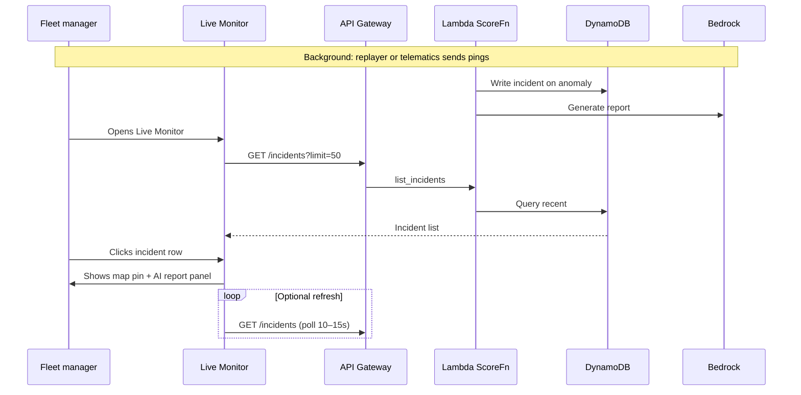
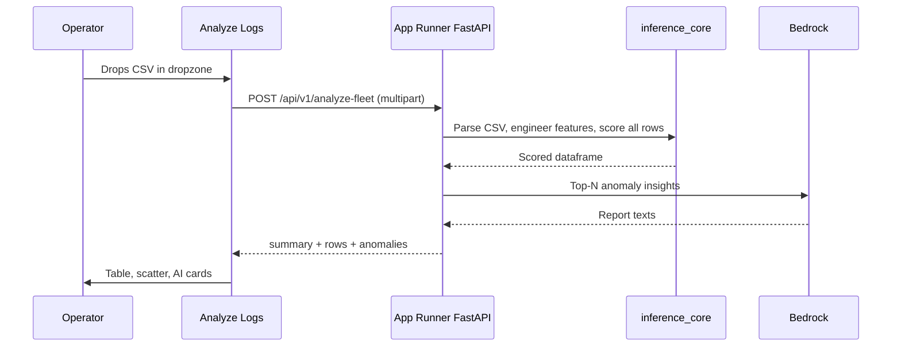

# FleetGuard — Application Flow

User journeys, screen map, and demo script for the Next.js dashboard.

---

## 1. Dashboard structure

```
┌─────────────────────────────────────────────────────────────┐
│  FleetGuard Command Center          [Live Monitor] [Analyze]│
├─────────────────────────────────────────────────────────────┤
│  Tab content (see below)                                    │
└─────────────────────────────────────────────────────────────┘
```

| Route | Tab | Path | Primary API |
| --- | --- | --- | --- |
| `/` or `/live` | **Live Monitor** | A | `NEXT_PUBLIC_API_URL` |
| `/analyze` | **Analyze Logs** | B | `NEXT_PUBLIC_BATCH_API_URL` |

Navigation lives in `layout.tsx` (sidebar or top nav). Both tabs share Tailwind design tokens.

---

## 2. Path A — Live Monitor flow

### 2.1 Primary user journey



### 2.2 Screen layout — Live Monitor

```
┌──────────────────┬──────────────────────────────────────────┐
│ Summary cards    │  Total vehicles │ Anomalies │ By type    │
├──────────────────┴──────────────────────────────────────────┤
│ Map (Leaflet)          │  Incident log (table)                │
│ Lagos, anomaly pins    │  vehicle, time, score, source      │
│ color by severity      │  filter: vehicle / source=realtime │
├────────────────────────┼──────────────────────────────────────┤
│                        │  AI Report panel (selected row)    │
│                        │  Bedrock incident text             │
└────────────────────────┴──────────────────────────────────────┘
```

### 2.3 Component mapping

| UI block | Component path | Data |
| --- | --- | --- |
| Summary cards | `components/ui/summary-cards.tsx` | Aggregate from incidents or static seed |
| Map | `components/charts/route-map.tsx` | `lat`, `lng` from incidents |
| Incident log | `components/ui/data-table.tsx` | `GET /incidents` |
| AI report | `components/reports/ai-insight-card.tsx` | `incident.report` |

### 2.4 Empty & error states

| State | UX |
| --- | --- |
| No incidents yet | "Waiting for telemetry… Run the replayer or check API URL." |
| API error | Toast + retry button; link to `.env.example` |
| Bedrock missing report | Show cached/fallback text if `report` empty |

---

## 3. Path B — Analyze Logs flow

### 3.1 Primary user journey



### 3.2 Screen layout — Analyze Logs

```
┌─────────────────────────────────────────────────────────────┐
│  File dropzone — "Upload trip log CSV"                      │
├──────────────────────────────┬──────────────────────────────┤
│  Summary                     │  Anomaly scatter chart       │
│  rows, anomaly_count, rate   │  safe vs suspicious trips    │
├──────────────────────────────┴──────────────────────────────┤
│  Scored data table (paginated) — click row for detail       │
├─────────────────────────────────────────────────────────────┤
│  AI insight cards (top anomalies)                           │
└─────────────────────────────────────────────────────────────┘
```

### 3.3 Component mapping

| UI block | Component path | Data |
| --- | --- | --- |
| Dropzone | `components/ui/file-dropzone.tsx` | Local file → FormData |
| Data table | `components/ui/data-table.tsx` | `response.rows` |
| Scatter | `components/charts/anomaly-scatter.tsx` | `score` vs `fuel_delta` or similar |
| AI cards | `components/reports/ai-insight-card.tsx` | `response.anomalies[].report` |

### 3.4 Upload rules

- Accept `.csv` only; max ~10 MB for demo
- Expected columns: see [data_schema.md](data_schema.md)
- Show parsing errors inline (missing columns, empty file)
- Loading state: spinner + "Analyzing N rows…" (Bedrock may add seconds)

---

## 4. Cross-cutting flows

### 4.1 First-time developer setup

1. Clone repo → read [team_guide.md](team_guide.md)
2. Copy `frontend/.env.example` → `.env.local` (API URLs after deploy)
3. Run ML locally: `fleetguard_prep` scripts (see team guide)
4. Run backend: `uvicorn` (Path B)
5. Run frontend: `npm run dev`

### 4.2 Deploy flow (CI/CD)

Push to `main` → GitHub Actions → ECR images → Terraform apply → CloudFront sync.
Details: [team_guide.md](team_guide.md) and [../fleetguard_prep/docs/technicals.md](../fleetguard_prep/docs/technicals.md) §8.

---

## 5. Demo script (5 minutes for judges)

**Lead with Path A (problem fit), close with Path B (practical + reliable).**

| Step | Time | Action | Say |
| --- | --- | --- | --- |
| 1 | 0:30 | Show Live Monitor empty → start replayer | "Vehicles stream GPS and fuel data in real time." |
| 2 | 1:00 | Incidents appear on map + log | "IsolationForest flags route deviation, fuel theft, private use, idle abuse." |
| 3 | 1:30 | Click incident → AI report | "Bedrock explains what happened and what the manager should do." |
| 4 | 2:30 | Switch to Analyze Logs tab | "Managers can also upload last week's CSV for instant forensic audit." |
| 5 | 3:00 | Upload `fleetguard_telemetry.csv` | "Same model — batch mode — no live stream required." |
| 6 | 4:00 | Show scatter + table + AI cards | "Top anomalies ranked with AI insights." |
| 7 | 4:30 | Mention scaling | "Production: IoT Core → Kinesis → Lambda; Timestream for history." |

### Demo fallback checklist

- [ ] Pre-seed incidents (`fleetguard_replay.py --mode seed`) if Bedrock slow
- [ ] Batch tab works offline from App Runner even if replayer fails
- [ ] Cached report text in DynamoDB for 2–3 headline incidents

---

## 6. State management (frontend)

| Tab | Hook | Strategy |
| --- | --- | --- |
| Live Monitor | `useIncidents()` | Poll `GET /incidents` every 10–15 s (WebSocket = future) |
| Analyze Logs | `useFleetAnalysis()` | Single mutation on file upload; no poll |

Use React Query or SWR — see `frontend/src/hooks/useFleetData.ts` (planned).

---

## 7. Links

- API shapes: [api_contract.md](api_contract.md)
- CSV columns: [data_schema.md](data_schema.md)
- Workstream ownership: [team_guide.md](team_guide.md)
