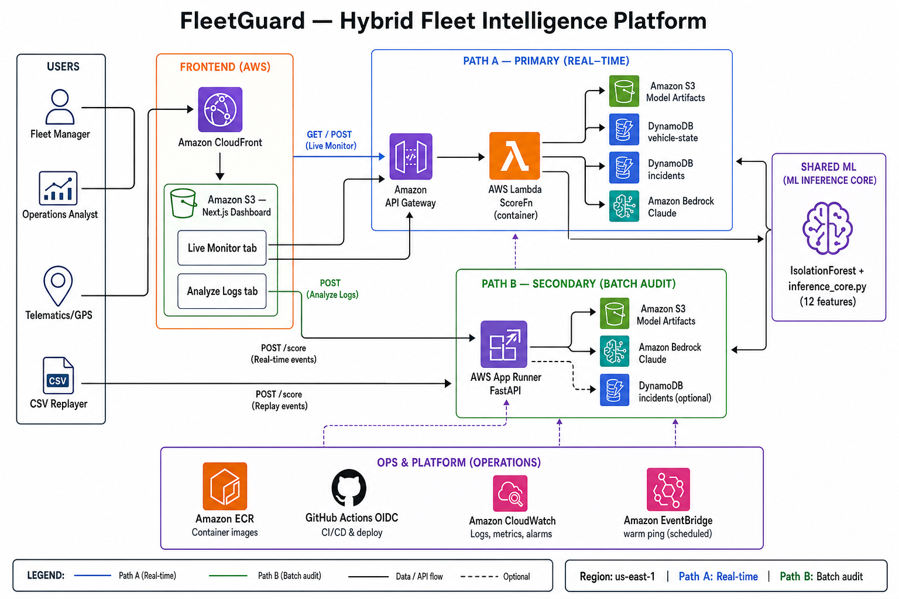
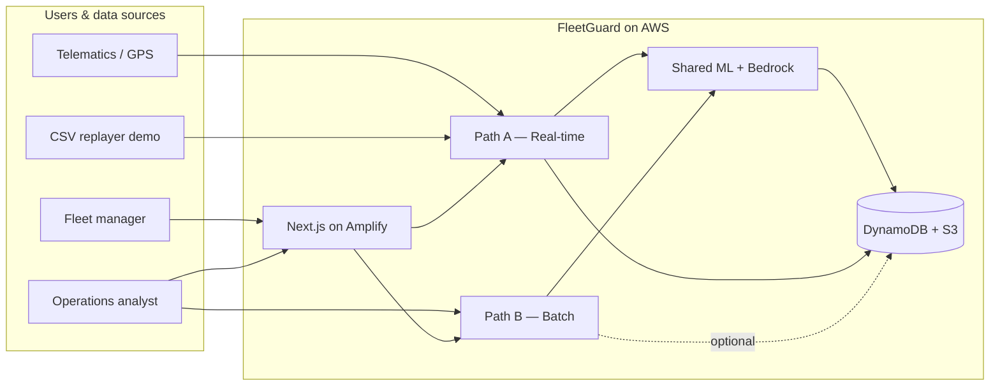
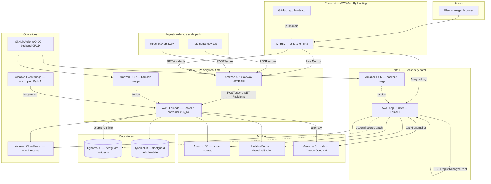
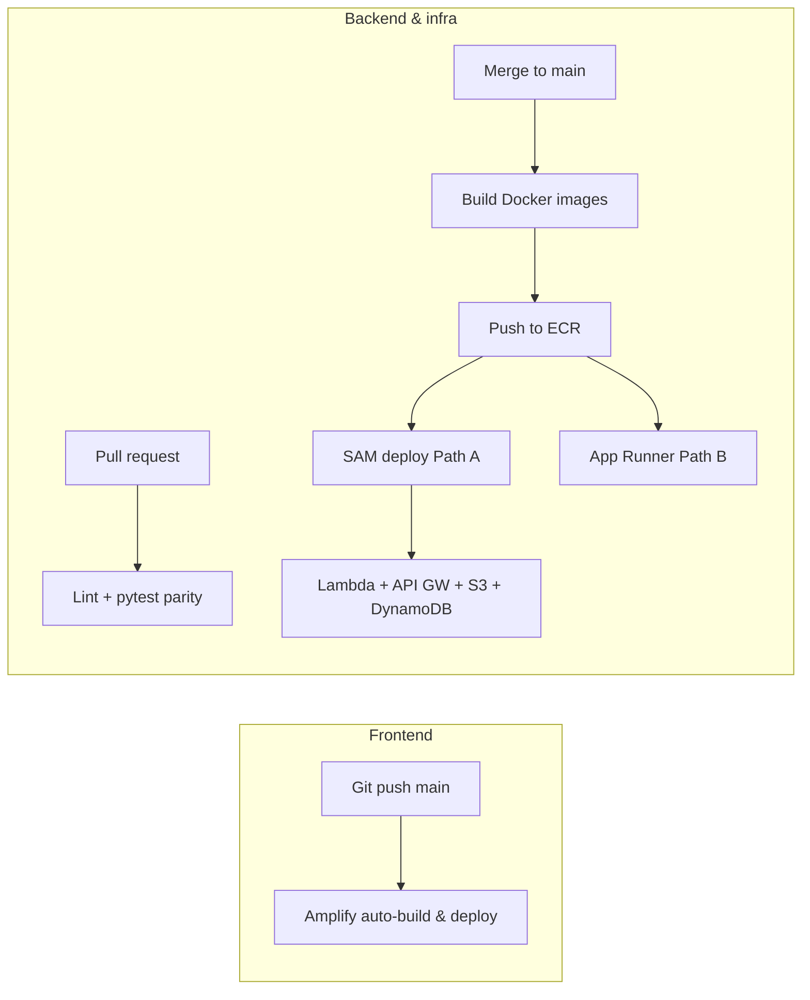

# FleetGuard — High-Level Architecture Diagram

Fleet intelligence platform for Nigerian logistics: detect **fuel theft**, **route abuse**, **private
vehicle use**, and **excessive idling** using **IsolationForest** (ML) and **Amazon Bedrock**
(AI incident reports).

**Hybrid design:** Path **A** = real-time monitoring (primary) · Path **B** = batch CSV audit (secondary).

**Frontend hosting:** **AWS Amplify Hosting** (Git → `frontend/`).



---

## 1. System context



---

## 2. Full AWS architecture (target deployment)

Region: **`us-west-2`**. Path A IaC: **`infrastructure/sam/`** (AWS SAM) · Frontend: **Amplify Console** (Git).



---

## 3. Monorepo → AWS mapping

| Repo folder | Runtime on AWS | Key endpoints |
| --- | --- | --- |
| `frontend/` | **AWS Amplify Hosting** | `/live`, `/analyze` dashboard tabs |
| `ml/src/realtime/` | **Lambda** (container) | `POST /score`, `GET /incidents` |
| `ml/src/inference/` | Loaded by Lambda + App Runner | Shared `inference_core.py` |
| `ml/models/` | **S3** `fleetguard-model/` | `.pkl`, `feature_cols.json` |
| `backend/` | **App Runner** (FastAPI) | `POST /api/v1/analyze-fleet`, `GET /healthz` |
| `infrastructure/sam/` | **AWS SAM** | Lambda, API Gateway, DynamoDB, S3 model bucket |
| `.github/workflows/` | **GitHub Actions → OIDC** | Backend/infra deploy |
| `frontend/amplify.yml` | **Amplify build spec** | `npm ci && npm run build` |

Architecture reference docs live in `fleetguard_prep/docs/`; active code is in `ml/` and `backend/`.

---

## 4. Path A — Real-time monitoring (primary)

**Purpose:** Flag anomalies as telemetry arrives.

| Step | Component | AWS service |
| --- | --- | --- |
| 1 | Device or replayer sends GPS/fuel ping | API Gateway |
| 2 | ScoreFn loads model, computes `fuel_delta` from last ping | Lambda + DynamoDB vehicle-state |
| 3 | IsolationForest scores 12 features | Lambda (sklearn in container) |
| 4 | Anomaly → Bedrock incident report | Amazon Bedrock |
| 5 | Persist incident (`source: realtime`) | DynamoDB |
| 6 | Dashboard polls incident feed | Amplify app → API Gateway → Lambda |

**API contract:** `docs/api_contract.md` · Handler: `ml/src/realtime/handler.py`

---

## 5. Path B — Batch log analysis (secondary)

**Purpose:** Upload trip CSV → instant forensic report.

| Step | Component | AWS service |
| --- | --- | --- |
| 1 | Operator uploads CSV via dropzone | Amplify app → App Runner |
| 2 | Parse CSV, `fuel_delta` via pandas groupby | App Runner |
| 3 | Same IsolationForest via `inference_core` | App Runner + S3 model |
| 4 | Top-N anomalies → Bedrock insights | Amazon Bedrock (Opus 4.6) |
| 5 | Return summary + rows + anomalies JSON | App Runner |
| 6 | Optional persist (`source: batch`) | DynamoDB |

**API contract:** `docs/api_contract.md` · Service: `backend/app/services/inference.py`

---

## 6. Shared ML layer

Both paths **must** use identical feature engineering (`ml/src/inference/inference_core.py`).

| Artifact | Location | Used by |
| --- | --- | --- |
| `fleetguard_anomaly_model.pkl` | S3 / `ml/models/` | Lambda, App Runner |
| `fleetguard_scaler.pkl` | S3 / `ml/models/` | Lambda, App Runner |
| `fleetguard_feature_cols.json` | S3 / `ml/models/` | Lambda, App Runner |

**12 features:** speed, fuel, engine, idle, hour, day, working hour, zone distance, fuel_delta,
off_hours_speed, idle_speed_ratio, zone_breach.

**Parity test:** `ml/tests/test_inference_parity.py`

---

## 7. Frontend (Next.js on Amplify)

| Tab | Route | Calls | UI |
| --- | --- | --- | --- |
| **Live Monitor** | `/live` | `NEXT_PUBLIC_API_URL` → `/incidents` | Map, incident log, AI drilldown via `/api/analyze` |
| **Analyze Logs** | `/analyze` | `NEXT_PUBLIC_BATCH_API_URL` → `/api/v1/analyze-fleet` | Dropzone, summary cards, top anomalies + Bedrock reports |

### Amplify setup

1. Connect GitHub repo; set app root to **`frontend/`**.
2. Build uses **`frontend/amplify.yml`** (`npm ci && npm run build`).
3. Set env vars in Amplify Console: `NEXT_PUBLIC_API_URL`, `NEXT_PUBLIC_BATCH_API_URL`, `AWS_REGION`, `BEDROCK_MODEL_ID`.
4. Attach IAM role with `bedrock:InvokeModel` for SSR `/api/analyze` route.
5. HTTPS at `https://main.<app-id>.amplifyapp.com` (or custom domain).

---

## 8. AWS services summary

| AWS service | Role in FleetGuard |
| --- | --- |
| **Amplify Hosting** | Next.js dashboard — Git build, HTTPS, env vars |
| **API Gateway (HTTP)** | Public API for Path A (`/score`, `/incidents`) |
| **Lambda (container)** | Real-time scoring + incident API |
| **App Runner** | FastAPI batch analysis (always warm) |
| **ECR** | Container images for Lambda + App Runner |
| **S3** | Model artifacts only (`fleetguard-model/`) |
| **DynamoDB** | Incidents table + vehicle-state table |
| **Bedrock** | Claude Opus 4.6 incident narratives |
| **CloudWatch** | Logs and metrics |
| **EventBridge** | Optional warm ping for Lambda cold starts |
| **GitHub Actions (OIDC)** | Backend + infra CI/CD (not frontend) |

### Future scale path (not in demo)

| Service | Use |
| --- | --- |
| **IoT Core / Kinesis** | High-volume telemetry ingestion |
| **Timestream** | GPS history & route replay |
| **SNS** | Email/SMS alerts to managers |
| **Cognito** | Fleet-manager authentication |
| **API Gateway WebSocket** | Live dashboard push |

---

## 9. Anomaly types detected

| Type | What FleetGuard watches |
| --- | --- |
| Route deviation | GPS far outside approved Lagos zones |
| Fuel theft | Large fuel drop while stationary |
| Private use | Movement off-hours, off-route |
| Excessive idle | Engine on, no movement, long idle time |

Algorithm: **unsupervised IsolationForest** — no labelled production data required.

---

## 10. CI/CD pipeline (split)



- **Frontend:** Amplify (Git-connected) — no S3/CloudFront sync in GitHub Actions.
- **Backend:** `.github/workflows/aws-deploy.yml` (scaffold).

---

## 11. Related documentation

| Document | Content |
| --- | --- |
| [docs/prd.md](docs/prd.md) | Product requirements |
| [docs/api_contract.md](docs/api_contract.md) | HTTP request/response shapes |
| [docs/app_flow.md](docs/app_flow.md) | User flows & demo script |
| [docs/data_schema.md](docs/data_schema.md) | CSV columns & DynamoDB schema |
| [frontend/README.md](frontend/README.md) | Amplify deploy steps |
| [frontend/amplify.yml](frontend/amplify.yml) | Amplify build specification |
| [fleetguard_prep/docs/technicals.md](fleetguard_prep/docs/technicals.md) | Implementation & deploy detail |
| [fleetguard_prep/docs/architecture.md](fleetguard_prep/docs/architecture.md) | Architecture narrative |

---

## 12. Diagram source

The PNG **`architecture-diagram.png`** is rendered from **`architecture-diagram.mmd`** (Mermaid).
Regenerate after edits:

```powershell
npx -y @mermaid-js/mermaid-cli -i architecture-diagram.mmd -o architecture-diagram.png -b white
```
